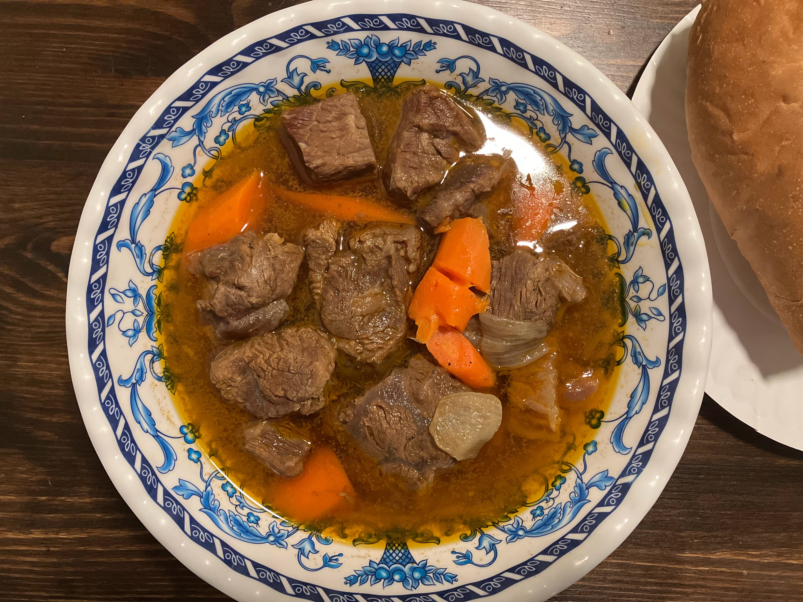
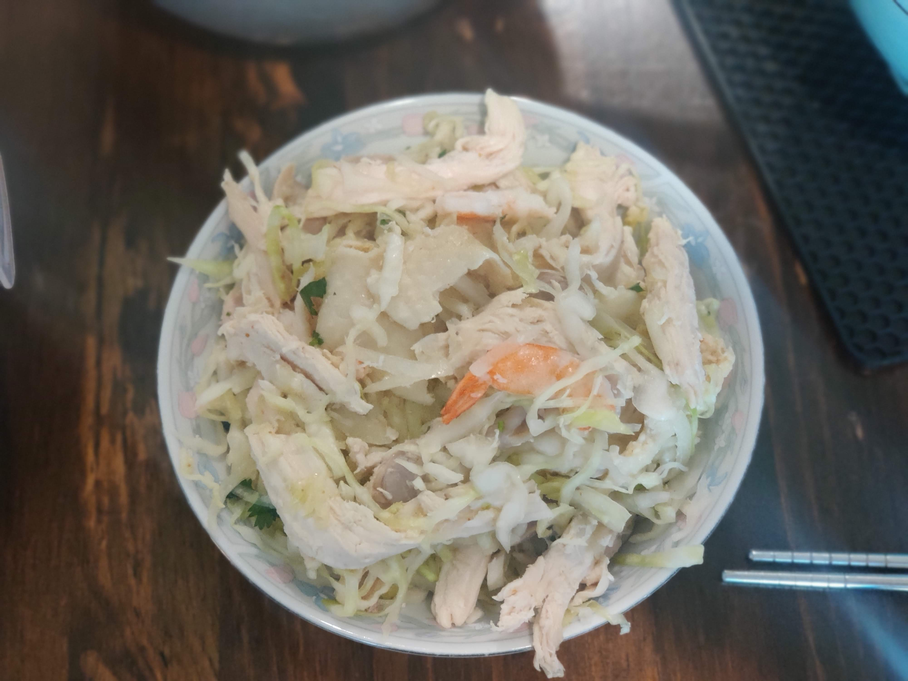
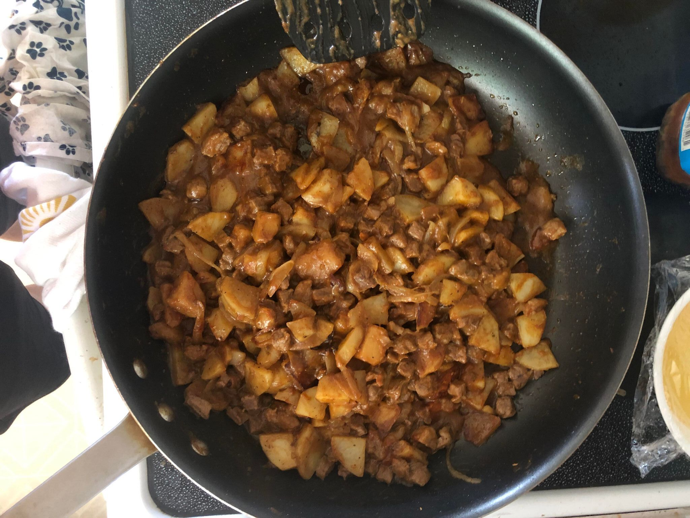
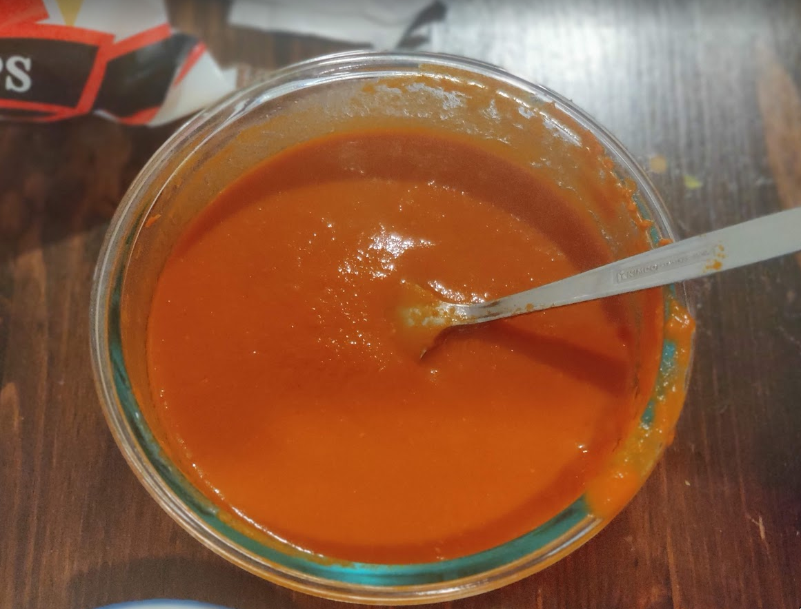
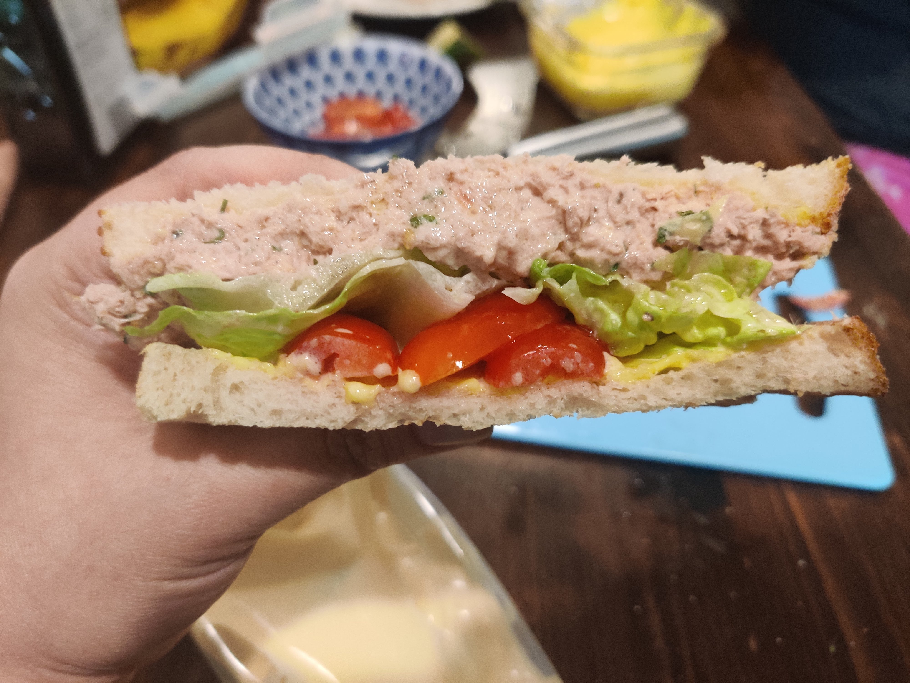

# Hawaiian Cuisine

## Tuna Poke
> A popular dish that originated in Hawaii, featuring fresh and cubed sushi-grade tuna marinated in a flavorful mixture of soy sauce, sesame oil, and other seasonings. The combination of tender tuna, crisp vegetables, and savory marinade creates a delicious and refreshing dish, perfect as an appetizer or light meal. Recipe curated by Nhu Vuong.

### Ingredients
- 1 lb Sushi Grade Tuna
- 2 tablespoons Soy Sauce
- 1 tablespoon Sesame Oil
- 2 green onions, thinly sliced
- 1 jalapeno, deseeded and diced
- 1/2 teaspoon Garlic Powder
- 1/4 teaspoon Black Pepper
- Pinch of Sugar
- Pinch of Salt
- Optional:
  - 1/4 teaspoon Korean Pepper Flakes
  - 1 shallot, finely chopped

### Instructions
1. Thaw the tuna and press between paper towels to remove any fishy smell.
2. Cube the tuna fillets into bite-sized pieces.
3. Thinly slice the green onion.
4. Deseed and cube the jalapeno.
5. Place the cubed tuna in a bowl and add the following ingredients, adjusting to taste:
6. Mix everything together.
7. Taste and adjust the ingredients above as needed. Enjoy!

## Spam Musubi
> Spam Musubi is a delicious and popular Hawaiian snack made with grilled Spam, seasoned rice, and wrapped in nori seaweed. It's a delightful combination of flavors and textures, perfect for a quick and satisfying treat. Recipe curated by Nhu Vuong.

### Ingredients:
- Nori (seaweed sheets), as needed
- 1 can of Spam
- Kewpie Mayo or Spicy Mayo
- Rice, preferably freshly cooked
- Optional:
  - Furikake
  - Sesame Oil (to season rice)
  - Egg

### Musubi Sauce:
- Garlic, to taste
- 1 tablespoon of Sugar
- 4 tablespoons of Soy Sauce
- 2 tablespoons of Water
- Pepper Flakes, to taste
- Green Onion, to taste
- Oil

### Instructions:
1. Cook your rice based on package instructions or with your preferred method.
2. Cut the nori sushi paper into the size of your spam slices.
3. Cut the spam into thin or thick slices according to your preference.
   - Note: If you want to make the Musubi sauce, follow the steps below.
4. Save the rectangular spam containers as molds.
5. Optional: Make a plain or buttered omelet/scrambled eggs and slice it into pieces approximately the size of your spam slices.
6. Season your rice with furikake or sesame oil, if desired.
7. Line the spam can with plastic wrap, leaving enough length to pull it back out of the can.
8. Layer the spam musubi as follows:
   1. Nori
   2. Spam
   3. Optional: Egg
   4. Rice
9. Carefully pull out the spam musubi and fold over the nori pieces on the bottom to wrap the musubi. Enjoy!

# Japanese Cuisine

## Chicken Katsu (Drumsticks)
> Crispy and juicy chicken drumsticks coated in a golden panko crust, served with tonkatsu sauce, shredded cabbage, and rice. A delicious and satisfying Japanese dish. Recipe curated by Nhu Vuong.

### Ingredients:
- 4 chicken drumsticks
- For the Brine:
  - 4 cups hot water
  - 1/4 cup salt
  - 2 tablespoons parsley
  - 1 teaspoon black pepper
  - 1 teaspoon paprika
  - 1/2 teaspoon cayenne pepper
  - 1/2 teaspoon lemon pepper
  - 1/2 teaspoon cumin
  - 1/4 teaspoon red chili pepper flakes
  - 1/4 teaspoon dill
- All-purpose flour
- Eggs, beaten
- Panko breadcrumbs
- Vegetable oil, for frying
- Tonkatsu sauce, for serving
- Shredded cabbage, for serving
- Cooked rice, for serving

### Instructions:
1. In a bowl, combine hot water, salt, parsley, black pepper, paprika, cayenne pepper, lemon pepper, cumin, red chili pepper flakes, and dill. Stir until the salt is dissolved.
2. Place the chicken drumsticks in a large resealable bag and pour the brine over them. Seal the bag and refrigerate for at least 2 hours, or overnight for best results.
3. Remove the drumsticks from the brine and pat them dry with paper towels.
4. Dredge the chicken drumsticks in flour, shaking off any excess.
5. Dip the drumsticks into the beaten eggs, allowing any excess to drip off.
6. Coat the drumsticks in panko breadcrumbs, pressing gently to adhere.
7. Heat vegetable oil in a large skillet or deep fryer over medium heat.
8. Fry the chicken drumsticks in the hot oil until golden brown and cooked through, about 12-15 minutes, turning occasionally.
9. Transfer the cooked chicken katsu drumsticks to a paper towel-lined plate to drain excess oil.
10. Serve the crispy and flavorful Dark Meat Chicken Katsu drumsticks with tonkatsu sauce, shredded cabbage, and cooked rice. Enjoy!

## Crab Salad
> Crab Salad is a refreshing and flavorful dish made with succulent crab meat, mayonnaise, and a variety of seasonings. It can be enjoyed as a light and satisfying appetizer or served as a filling in sandwiches or wraps for a tasty meal option. Recipe curated by Sandy Tran.

### Ingredients
- Imitation Crab Flake (desired amount)
  - Note: Stick style imitation crab is also suitable
- Kewpie Mayo (to taste)
- Sriracha (to taste)
- Black Pepper (to taste)
- Crackers or Chips
- Optional:
  - Sriracha Mayo
  - Green Onion

### Instructions
1. Chop the imitation crab into small, scoopable chunks. If using stick style imitation crab, hand shred it.
2. In a bowl, combine the chopped imitation crab, Kewpie Mayo, and Sriracha. Mix well and add black pepper to taste.
3. Adjust the flavors by repeating step 2 until you achieve your desired taste.
4. Optionally, garnish with green onions.
5. Serve the Quick & Easy Crab Salad with chips or crackers for a delightful snack. Enjoy!

# Vietnamese Cuisine

## Bo Kho

> Vietnamese beef stew known for its rich and aromatic flavors. It features tender beef chunks, carrots, onions, lemongrass, and warming spices like star anise, ginger, and garlic, slow-cooked in a flavorful broth until the meat is melt-in-your-mouth tender. Recipe curated by Nhu Vuong.

### Ingredients
- 1.5 lbs of tendon
- 1 lb of beef flanks
- 1 lb of short rib
- 1 lb of chuck roast, cut into cubes
- 2 large carrots, peeled and sliced
- 1 medium whole onion
- 3 medium shallots
- 1 tbsp of garlic powder
- 3 Stalks of lemongrass
- 1 tsp of MSG
- 1 tbsp of ginger, sliced
- 1 Packet of Bo Kho Seasoning
- 1 tbsp of Rock Sugar
- 1/2 Cup of "Better Than Bouillon Beef"
- A Can of Coconut Water
- 1 tbsp fish sauce

### Instructions
1. Bring a pot of water to a boil. Add 1 tsp of salt and add 2 stalks of chopped up lemongrass.
2. Boil all the meats for 30 min. Then rinse and cut into large bite-sized cubes.
3. Dice onion and shallots.
4. Place cuts of meat into a mixing bowl. Marinate meat with bo kho seasoning powder, lemongrass, diced onion, diced shallot, ginger, garlic powder, MSG, tossed until combine. Set aside for 30 min-1 hr or overnight.
5. In a large pot, fry 1 tsp of oil over med-high heat. Add in marinaded mixture and stir fry in pot for about 5-10 mins.
6. Pour in can of coconut water.
7. Pour in enough water to cover meats.
8. Turn heat to high and wait until boil.
9. After stock is boiled, reduce heat to low-medium.
10. Simmer for 2-3 hours or until meat and tendon has soften.
11. Occasionally skim oil from broth surface.
12. Roughly 30 minutes before meat is tender, add in fish sauce.
13. Adjust taste to preferred peference. Enjoy!

## Tilapia Fried Fish Paste
> "Cha Ca" in Vietnamese, is a popular dish that is made by marinating bite-sized pieces of tilapia fish in fish sauce, garlic, and other spices. The marinated fish is then pan-fried until crispy and served with rice noodles, herbs, and a variety of accompaniments. Recipe curated by Nhu Vuong.

### Ingredients
- 3 filets of tilapia fish; thawed, washed, and dried
- 1 tsp of salt and pepper
- 1 tsp of sugar
- 2 tsp of fish sugar
- 1 tsp of garlic powder
- 1/2 tsp of corn starch
- 1 tbsp of ice cold water
- 1/2 tbsp of olive oil

### Instructions
1. Throw all ingredients in blender, exluding ice cold water.
2. Blend for 10 seconds until all ingredients are mixed.
3. Occasionally adding ice cold water a little at a time until neccasary until there is a bouncy consistency.
4. After 4 to 5 min of blending, pour out into a clean bowl. If mixture is runny, add corn starch; otherwise chill for 1 hour or overnight in the fridge.
5. After chilled, heat a pan with oil with med to high heat.
6. Cover hand with oil and shape paste into desired shape.
7. Fry until golden brown. Enjoy!

## Goi Ga

> Vietnamese chicken salad made with poached chicken, shredded vegetables, herbs, and a fish sauce-based dressing. It is a refreshing and flavorful dish commonly eaten as a light meal, and can be served on its own or as part of a larger Vietnamese meal. Recipe curated by Nhu Vuong.

### Ingredients
- 2 cup poached chicken, shredded or thinly sliced
- 2 cup sliced Shrimp
- 3 cup shredded cabbage or lettuce
- 1/2 cup fresh herbs, such as mint and cilantro
- 1/2 cup sliced onions or peppers (optional)
- 2 tbsp fish sauce
- 2 tbsp lime juice
- 1 tbsp sugar
- 1-2 chili peppers, seeded and minced (adjust to taste)
- 1/4 cup chopped peanuts or fried shallots (optional)

### Instructions
1. In a large bowl, combine the shredded chicken, shredded cabbage or lettuce, fresh herbs, and sliced onions or peppers (if using).
2. In a small bowl, whisk together the fish sauce, lime juice, sugar, and minced chili peppers to make the dressing.
3. Pour the dressing over the salad and toss to combine.
4. Taste and adjust the seasoning as needed, adding more fish sauce, lime juice, sugar, or chili peppers to taste.
5. Sprinkle the chopped peanuts or fried shallots (if using) over the top of the salad just before serving.
6. Serve the salad immediately as a light meal or as part of a larger Vietnamese meal. Enjoy!

## Pho Ga
> A comforting and fragrant Vietnamese soup made with chicken, rice noodles, and a flavorful broth infused with aromatic spices. Pho Ga is a popular street food in Vietnam and is enjoyed for its delicate flavors and nourishing qualities. Recipe curated by Nhu Vuong.

### Ingredients
- 1 whole chicken (about 3-4 lbs), giblets removed
- 1 onion, peeled and halved
- 4-inch piece of ginger, sliced
- 4 cloves of garlic, crushed
- 2 cinnamon sticks
- 3 star anise
- 6 cloves
- 1 tablespoon coriander seeds
- 2 teaspoons salt
- 8 cups chicken broth
- 8 oz rice noodles (banh pho)
- Garnishes: bean sprouts, fresh herbs (Thai basil, cilantro, mint), lime wedges, sliced chili peppers

### Instructions
1. In a large pot, bring water to a boil. Add the chicken, onion, ginger, garlic, cinnamon sticks, star anise, cloves, coriander seeds, and salt.
2. Reduce the heat to low and simmer for about 1 hour, or until the chicken is cooked through and tender.
3. Remove the chicken from the pot and let it cool slightly. Shred the chicken meat and set aside.
4. Strain the broth through a fine-mesh sieve to remove the solids. Return the broth to the pot and discard the solids.
5. Bring the broth back to a simmer. Taste and adjust the seasoning if needed.
6. Meanwhile, cook the rice noodles according to the package instructions. Drain and rinse with cold water to prevent sticking.
7. Divide the cooked rice noodles among serving bowls. Top with shredded chicken.
8. Ladle the hot broth over the noodles and chicken, ensuring that the noodles are submerged in the broth.
9. Serve the Pho Ga hot with bean sprouts, fresh herbs, lime wedges, and sliced chili peppers on the side.
10. Allow each person to garnish their bowl according to their taste preferences.
11. Enjoy your comforting and delicious Pho Ga!

## Texas Banh Mi
> A classic Vietnamese sandwich filled with a combination of savory and flavorful ingredients. It features a crispy baguette filled with marinated meat, pickled vegetables, fresh herbs, and a variety of condiments. Recipe curated by Tony Nguyen.

### Ingredients
- 1 baguette
- 1/2 pound thinly sliced pork belly or grilled chicken
- 1/2 cup mayonnaise
- 1 tablespoon soy sauce
- 1 tablespoon fish sauce
- 1 tablespoon sugar
- 1 teaspoon garlic powder
- 1 cup pickled vegetables (carrots and daikon radish)
- Fresh cilantro leaves
- Fresh mint leaves
- Fresh cucumber slices
- Sliced jalapenos (optional)

### Instructions
1. Preheat the oven to 350°F (175°C).
2. Slice the baguette lengthwise, leaving one side intact to form a hinge.
3. In a small bowl, combine the mayonnaise, soy sauce, fish sauce, sugar, and garlic powder to make a sauce. Set aside.
4. If using pork belly, cook it in a skillet over medium heat until crispy and cooked through. If using grilled chicken, make sure it's fully cooked and sliced thinly.
5. Spread the sauce mixture on both sides of the baguette.
6. Layer the pork belly or grilled chicken on the bottom half of the baguette.
7. Top with pickled vegetables, fresh cilantro leaves, mint leaves, cucumber slices, and sliced jalapenos (if desired).
8. Close the sandwich and wrap it tightly in aluminum foil.
9. Place the wrapped sandwich in the preheated oven and bake for about 10 minutes to warm and crisp the bread.
10. Remove from the oven and let it cool slightly.
11. Unwrap the sandwich, slice it into smaller portions if desired, and serve.
12. Enjoy your delicious Banh Mi sandwich!

## Bun Bo Hue
> A spicy and aromatic Vietnamese noodle soup originating from the city of Hue. It features tender beef, pork, and rice noodles in a flavorful broth infused with lemongrass, shrimp paste, and chili oil. Recipe curated by Tony Nguyen.

### Ingredients
- 1 lb beef shank
- 1 lb pork bones
- 1 lb pork belly or pork shoulder, thinly sliced
- 1 tablespoon shrimp paste
- 1 tablespoon vegetable oil
- 2 tablespoons lemongrass, minced
- 1 tablespoon garlic, minced
- 1 tablespoon chili oil
- 1 tablespoon fish sauce
- 1 tablespoon sugar
- 1 teaspoon paprika
- 8 cups beef broth
- Rice noodles (Bun Bo Hue noodles)
- Bean sprouts
- Fresh herbs (Thai basil, cilantro, mint)
- Lime wedges
- Sliced onions
- Sliced chili peppers
- Optional toppings: pig's blood cake, sliced banana blossoms

### Instructions
1. In a large pot, bring water to a boil. Add the beef shank and pork bones. Boil for 10 minutes, then drain and rinse the meat.
2. In the same pot, heat the vegetable oil over medium heat. Add the minced lemongrass and garlic. Sauté for a few minutes until fragrant.
3. Add the beef shank, pork bones, and thinly sliced pork belly or pork shoulder to the pot. Stir in the shrimp paste, chili oil, fish sauce, sugar, and paprika.
4. Pour in the beef broth and bring to a boil. Reduce heat to low and simmer for 2-3 hours until the meat is tender and the flavors are well combined.
5. While the broth is simmering, prepare the rice noodles according to the package instructions. Drain and set aside.
6. Prepare the toppings by blanching the bean sprouts, washing and plucking the fresh herbs, slicing the onions and chili peppers, and any other optional toppings you desire.
7. Once the broth is ready, remove the meat from the pot and slice it into bite-sized pieces.
8. To serve, place a portion of rice noodles in a bowl. Add the sliced meat on top and ladle the hot broth over the noodles and meat.
9. Garnish with bean sprouts, fresh herbs, sliced onions, sliced chili peppers, and any optional toppings.
10. Serve with lime wedges on the side.
11. Enjoy your flavorful and spicy Bun Bo Hue soup!

## Com Special
> Karden's Com Special is a beloved childhood meal consisting of rice topped with hotdog (and optional spam), drizzled with Kewpie Mayo and soy sauce. This delightful and simple dish holds a special place in Karden's heart, providing a comforting and satisfying meal that brings back fond memories of his youth. Recipe curated by Karden Tran.

### Ingredients
- Rice
- Kewpie Mayo
- Soy Sauce
- Optional:
  - Spam
  - Hotdog

### Instructions
1. Cook the rice according to your preferred method.
2. Slice the hotdog into bite-sized pieces.
3. If using spam, slice it into thin slices as well.
4. In a pan, cook the hotdog (and spam, if using) until browned and heated through.
5. Once the rice is cooked, place it in a bowl.
6. Top the rice with the cooked hotdog (and spam, if using).
7. Drizzle Kewpie Mayo and soy sauce over the rice and hotdog.
8. Mix everything together to ensure the flavors are well combined. Enjoy!

## Ngoc's Curry

> A flavorful and hearty curry dish with tender beef cubes, potatoes, and onions, infused with aromatic spices. This recipe by Ngoc Vuong is easy to prepare and perfect for a comforting meal. Enjoy it with steamed rice.

### Ingredients
- 2 packets of S&B Golden Curry (medium hot or hotter)
- 4 potatoes
- 1/2 large white onion
- A ziplock bag’s worth of beef cubes
- 2 tablespoons butter
- 2 tablespoons oil
- Seasonings:
  - 1 teaspoon cumin
  - 1/2 teaspoon black pepper
  - 1/2 teaspoon Korean chili powder
  - 2 teaspoons assi beef flavor soup stock powder
  - 1/2 teaspoon garlic powder
  - 1/2 teaspoon onion powder
  - 1/2 teaspoon oregano

### Instructions
1. Wash and peel off the potatoes. Cut them into cubes.
2. Thinly slice the onion.
3. Pan fry the potatoes and onion in a mix of butter and oil. After they have slightly crisped up, add in all the seasonings, except for the beef flavor soup stock powder and black pepper.
4. Once the onion and potatoes have crisped up and caramelized, add in the beef cubes. Season with the beef flavor soup stock powder (two spoons), black pepper, cumin, and the other seasonings. Mix everything together.
5. Place the two curry packets in a pot of boiling water for several minutes.
6. Once the beef has been cooked and the curry packets are very hot, pour the curry into the pan. Place on low heat and keep mixing it up.
7. Add extra seasoning, specifically Korean chili powder and black pepper.
8. Serve with steamed rice. Enjoy!

# Hispanic Cuisine

## Red Guajillo Salsa

> A vibrant and flavorful Mexican salsa made with rehydrated guajillo chilies, tomatoes, garlic, onions, and spices. It offers a slightly smoky and tangy taste with a hint of heat, perfect for adding a burst of flavor to tacos, grilled meats, or as a dipping sauce. Recipe curated by Nhu Vuong.

### Ingredients
- 6 dried guajillo chillis: washed and soaked in water to rehydrate
- 5 to 6 red roma tomatoes
- 4 thai chilis
- 1-2 jalapeño
- 3 clove garlic
- 1/2 onion
- 1/4 cup chopped cilantro
- cumin
- salt
- chicken bouillon, season to taste

### Instructions
1. Boil/grill/or seared with oil: guajillo, chili, tomatoes, jalapeños, garlic, onion
2. Blend with cilantro and season to taste. Enjoy!

## Refried Bean Dip
> A flavorful and creamy dip made primarily with refried beans as the base ingredient. It is often served as an appetizer or party dip and is popular in Mexican cuisine. Recipe curated by Nhu Vuong.

### Ingredients
- 1 can refried beans
- sour cream
- cream cheese/greek yogurt
- cheese
- green onions
- chopped jalapeno
- corn
- cumin
- salt
- cayenne
- paprika
- oregano
- garlic powder
- onion powder
- parsley powder

### Instructions
1. Mix ingredients together, pour into baking tray, top with cheese.
2. Bake 400 for 15 mins.
3. Grab some chips. Enjoy!

# American Cuisine

## Tuna Sandwich

> A classic and versatile dish consisting of a filling made from canned tuna mixed with mayonnaise and other ingredients, served between slices of bread. It offers a satisfying blend of flavors and textures, making it a popular choice for a quick and delicious meal or snack. Recipe curated by Tony Nguyen

### Ingredients
- Sour Wheat Bread (Bought from Costco)
- 1 Can of Tuna
- Kewpie Mayo
- Salt and Pepper
- Sliced Tomatos
- Olive oil
- Lettuce
- Lemon

1. Grab a mixing bowl and toss in the canned tuna.
2. Add Lemon juice, Kewpie Mayo along with salt & pepper, adjust to your liking and mix.
3. Air fry or toast 2 Sour Wheat breads.
3. While the bread is cooking, go ahead and slice your tomatoes.
4. Take your toasted break, add mixed tuna then your sliced tomatoes.
5. Garnish the tomatoes with salt & pepper along with some olive oil.
6. Add some lettuce on top then some more Kewpie mayo.
7. Finish off with the other toasted slice of bread and cut into triagles. Enjoy!

## Simple Medium Rare Steak (Tony Style)
> A perfectly cooked medium-rare steak is a tender and juicy delight. Seasoned with salt and black pepper, it offers a mouthwatering balance of flavors and a pink, slightly warm center that's sure to satisfy steak enthusiasts. Recipe curated by Tony Nguyen.

### Ingredients:
- 1 medium-sized steak (such as ribeye, striploin, or tenderloin)
- Salt
- Black pepper

### Instructions:
1. Take the steak out of the refrigerator and let it come to room temperature for about 30 minutes.
2. Preheat your grill, stovetop skillet, or broiler to high heat.
3. Season both sides of the steak generously with salt and black pepper.
4. Place the steak on the grill, skillet, or under the broiler and cook for approximately 4-5 minutes on each side for a 1-inch thick steak, or adjust the cooking time according to the thickness of your steak.
5. For a medium-rare steak, the temperature should read around 130-135°F (55-57°C).
6. Remove the steak from the heat and let it rest for 5-10 minutes to allow the juices to redistribute.
7. Slice the steak against the grain and serve. Enjoy!

## Baked Corned Beef
> Baked Corned Beef is a flavorful dish made from a pack of flat-cut corned beef brisket, seasoned with its accompanying packet. This tender and delicious meat is baked to perfection, creating a mouthwatering meal that can be enjoyed sliced and served hot. Recipe curated by Nhu Vuong.

### Ingredients
- 1 pack of Flat Cut Corned Beef Brisket (with seasoning packet inside)

### Instructions
1. Pre-heat oven to 325°F or use an air fryer.
2. Open the packet of corned beef brisket and set the seasoning packet aside.
3. Rinse the corned beef to remove excess blood, then pat dry with a paper towel.
4. Use a mallet to lightly crush the seasoning packet to enhance the flavors.
5. Evenly spread the contents of the seasoning packet over the corned beef.
6. Place the corned beef on a baking tray or air fryer tray.
7. Bake covered in the oven at 325°F for 1 hour, then uncover and bake for an additional 30 minutes to 1 hour until cooked inside.
8. If using an air fryer, set it to 330°F and bake for 1 hour.
9. Allow the corned beef to rest for 30 minutes before slicing.

# Italian Cuisine

## Chicken Alfredo Pasta
> A classic Italian dish featuring tender chicken pieces and fettuccine pasta tossed in a creamy Alfredo sauce. This recipe is rich, comforting, and perfect for pasta lovers. Recipe curated by Tony Nguyen.

### Ingredients
- 1 lb boneless, skinless chicken breasts, cut into strips
- 1 lb fettuccine pasta
- 4 cloves of garlic, minced
- 1 cup heavy cream
- 1 cup grated Parmesan cheese
- 1/2 cup unsalted butter
- 1/4 cup chopped fresh parsley
- Salt and pepper to taste

### Instructions
1. Bring a large pot of salted water to a boil. Cook the fettuccine pasta according to the package instructions until al dente. Drain and set aside.
2. In a large skillet, melt the butter over medium heat. Add the chicken strips and minced garlic to the skillet. Cook until the chicken is no longer pink and cooked through.
3. Pour the heavy cream into the skillet with the cooked chicken. Stir in the grated Parmesan cheese and continue to cook, stirring frequently, until the sauce thickens and becomes creamy.
4. Season the sauce with salt and pepper to taste. Add the cooked fettuccine pasta to the skillet and toss to coat the pasta evenly with the sauce.
5. Remove from heat and garnish with chopped fresh parsley.
6. Serve hot. Enjoy!

# Chinese Cuisine

## Vegetable Stir-Fry
> A quick and healthy dish packed with colorful vegetables and tossed in a flavorful stir-fry sauce. This recipe is versatile and allows you to customize the vegetables based on your preferences. Recipe curated by Tony Nguyen.

### Ingredients
- 2 cups mixed vegetables (e.g., bell peppers, broccoli florets, carrots, snap peas)
- 1 cup sliced mushrooms
- 1 tablespoon vegetable oil
- 2 cloves of garlic, minced
- 1 tablespoon soy sauce
- 1 tablespoon oyster sauce
- 1 teaspoon cornstarch
- 1/4 cup water
- Salt and pepper to taste
- Optional: sesame seeds and green onions for garnish

### Instructions
1. In a small bowl, whisk together the soy sauce, oyster sauce, cornstarch, and water. Set aside.
2. Heat the vegetable oil in a large skillet or wok over medium-high heat.
3. Add the minced garlic to the skillet and cook for about 30 seconds until fragrant.
4. Add the mixed vegetables and sliced mushrooms to the skillet. Stir-fry for 3-5 minutes until the vegetables are crisp-tender.
5. Pour the sauce mixture over the vegetables and stir to coat evenly. Cook for an additional 1-2 minutes until the sauce thickens.
6. Season with salt and pepper to taste.
7. Remove from heat and garnish with sesame seeds and green onions, if desired.
8. Serve hot over steamed rice or noodles.
9. Enjoy your delicious vegetable stir-fry!

## Veggie Dip
> Veggie dip is a creamy and flavorful condiment perfect for enjoying with fresh vegetables. Its combination of herbs, spices, and tangy ingredients adds a delicious twist to raw veggies, making it a popular and healthy snack option. Recipe curated by Nhung Vuong.

### Ingredients
- 2 packs of cream cheese
- 1 cup of american mayo
- 1 packet of Ranch Seasoning – 1 Packet

### Instructions
1. Leave your 2 packs of cream cheese out to soften.
2. Once your Cream Cheese is softened place both packs in a bowl.
3. Place your 1 cup of american mayo in the bowl with your cream cheese.
4. Pour in your 1 pack of ranch seasoning.
5. Mix until the dip is homogeneous and the ranch seasoning isdispersed thoroughly.
6. Enjoy the dip with your favorite veggies!

# Thai Cuisine

## Papaya Salad
> Papaya Salad with Shrimp and Squid is a refreshing and vibrant dish that combines the crispiness of green papaya with tender seafood. The combination of tangy flavors from lime juice, fish sauce, and chili creates a perfect balance in this Thai-inspired salad. Recipe curated by Di Bah.

### Ingredients
- Salad portion of shredded Papaya
- 3 tablespoons of vinegar
- 2 tablespoons of fish sauce
- 3 tablespoons of sugar
- 1 unripe papaya
- 3 cups of squid
- 3 cups of shrimp
- Garlic
- Chili Pepper

### Instructions
1. Wash and peel the unripe papaya. Shred the papaya into thin strips using a grater or julienne peeler.
2. In a mixing bowl, combine the shredded papaya, vinegar, fish sauce, and sugar. Toss well to coat the papaya with the dressing. Set aside for 15 minutes to allow the flavors to meld together.
3. Meanwhile, boil the shrimp in a pot of salted water until cooked through. Drain the shrimp and peel off the shells.
4. In a separate pot of boiling water, cook the squid until tender. If desired, score the squid bodies with a sharp knife before cooking.
5. Once the shrimp and squid are cooked, let them cool slightly.
6. Slice the squid into rings and add both the shrimp and squid to the marinated papaya salad. Toss gently to combine.
7. Serve the Papaya Salad with Shrimp and Squid as a refreshing appetizer or a light main dish.
8. Optional: Garnish with minced garlic and sliced chili pepper for an extra kick of flavor. Enjoy!

# Korean Cuisine

## Gochujang Alfredo Pasta
> A flavorful and creamy dish featuring penne pasta tossed in a spicy and tangy sauce made with gochujang and alfredo sauce. Served with seared chicken and garnished with green onions, it's a satisfying and delicious meal option. Recipe curated by Nhu Vuong.

### Ingredients:
- 8 oz (225 g) penne pasta
- 2 tbsp gochujang
- 1 cup (240 ml) alfredo pasta sauce
- 2 cloves of garlic, chopped
- 1 tbsp tomato paste
- 1 tsp chili oil
- 2 tbsp olive oil
- 1 boneless, skinless chicken breast, seared and sliced
- 2 green onions, chopped

### Instructions:
1. Boil the penne pasta according to the package instructions for the medium cooking time (e.g., 9-11 minutes). Cook for about 10 minutes as it will finish cooking in the sauce. Reserve some pasta water and drain the pasta. Set aside.
2. In a pan, heat olive oil and sear the seasoned chicken (seasoned with paprika, cayenne, gochugaru, garlic powder, salt, pepper, etc.) until cooked through. Remove the chicken from the pan and slice it. Set aside.
3. In the same pan, add chopped garlic and stir-fry until fragrant. Then add gochujang, tomato paste, garlic, alfredo sauce, chili oil, and some pasta water. Stir until the sauce boils, then toss in the cooked chicken. Season to taste.
4. Add the cooked pasta to the pan and toss everything together until well combined. Turn off the heat and continue tossing lightly.
5. Drizzle the dish with green onions and parsley.

# Lao Cuisine

## Baked Eggs
> Baked Eggs is a savory and flavorful dish made with cracked eggs mixed with a combination of seasonings and baked until set. This easy-to-make recipe results in delicious and creamy baked eggs that can be enjoyed as a breakfast or brunch option. Recipe curated by Nhu Vuong.

Ingredients:
- 3 dozen eggs
- 1/2 cup fish sauce
- 1/2 cup oil
- 1/2 cup chicken bouillon powder
- 1/4 cup sugar
- 1/2 cup garlic powder
- 1/2 cup onion powder
- 1/4 cup black pepper
- 1/2 cup Korean red pepper powder
- 1/4 cup chili flakes (optional)
- 1 tsp MSG (optional)
- Whisk/chopsticks
- Soup spoon
- Large mixing bowl
- Glass measuring cup

Directions:
1. Preheat oven to 165°F.
2. Use a small soup spoon to crack a small hole into the pointy end of each egg and empty the contents into a large mixing bowl. Place the emptied eggshells back into their original cartons.
3. In the large mixing bowl with the egg contents, add the measured amounts of fish sauce, oil, chicken bouillon powder, sugar, garlic powder, onion powder, black pepper, Korean red pepper powder, chili flakes (if desired), and MSG (if desired).
4. Mix well using a whisk or chopsticks until all the ingredients are incorporated and the mixture becomes smooth.
5. Pour the mixed egg contents back into the eggshells using a glass measuring cup, filling them all the way. Place the filled eggshells back in the cartons.
6. Place the egg-filled cartons in the preheated oven and bake at 165°F for approximately 1.5-2 hours or until the egg mixture is set and does not stick to a toothpick.
7. Remove from the oven and let the baked eggs cool before serving. Enjoy!
